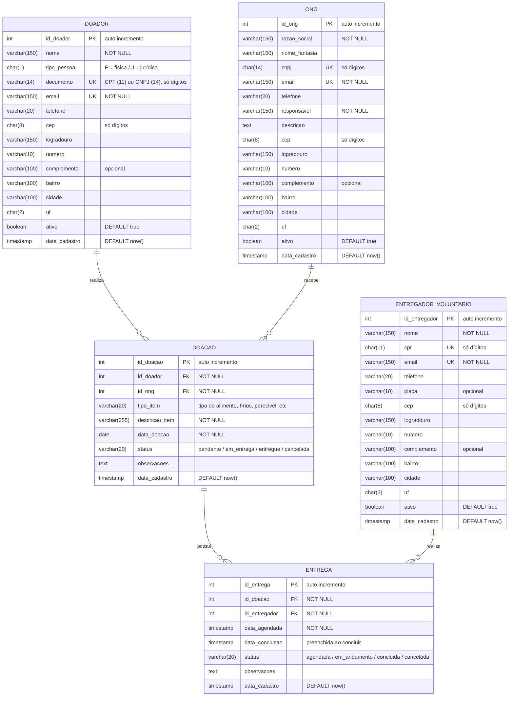

# Modelo de Dados — Sistema de Doações

## Principais relacionamentos

| Relacionamento | Cardinalidade | Descrição |
|---|---|---|
| DOADOR → DOAÇÃO | 1:N | Um doador pode realizar várias doações; toda doação tem exatamente um doador. |
| ONG → DOAÇÃO | 1:N | Uma ONG pode receber várias doações; toda doação é destinada a exatamente uma ONG. |
| DOAÇÃO → ENTREGA | 1:N | Uma doação pode ter uma ou mais entregas (ex.: entregas parciais ou reagendamentos); toda entrega pertence a uma doação. |
| ENTREGADOR/VOLUNTÁRIO → ENTREGA | 1:N | Um entregador/voluntário pode realizar várias entregas; toda entrega é feita por um entregador. |

## Domínios dos campos de status e tipo

| Tabela | Campo | Valores permitidos |
|---|---|---|
| DOADOR | tipo_pessoa | `F`, `J` |
| DOACAO | tipo_item | `tipo do alimento`, `Frios`, `perecivel`, `etc` |
| DOACAO | status | `pendente`, `em_entrega`, `entregue`, `cancelada` |
| ENTREGA | status | `agendada`, `em_andamento`, `concluida`, `cancelada` |

Esses campos podem ser implementados como `VARCHAR` com restrição `CHECK` ou como tipo `ENUM`, conforme o banco de dados utilizado.

## Regras de integridade

- `documento` do doador deve ter 11 dígitos quando `tipo_pessoa = 'F'` e 14 dígitos quando `tipo_pessoa = 'J'`.
- `data_conclusao` da entrega só é preenchida quando `status = 'concluida'` e não pode ser anterior a `data_agendada`.
- CPF, CNPJ, CEP e telefone são armazenados como texto (somente dígitos), nunca como número, para preservar zeros à esquerda.
- Registros com doações ou entregas vinculadas não devem ser excluídos fisicamente; use `ativo = false`.

## Correções em relação à versão anterior

- Gerado documento .md utilizando mermaid e suporte do Claude.ai para otimizar a utilização da ferramenta.
- Adicionado novas campos referente a informações adicionais, como tipagem do alimento, TimeStamp e endereço de ONG/Doador.
- Adicionado Tabela Entregador com os campos corrigidos.
- Adicionado os Tipos dos dados vinculados.

## Legenda

- **PK** = Chave Primária
- **FK** = Chave Estrangeira
- **UK** = Chave Única (valor não pode se repetir)
- **1** = Um registro
- **N** = Muitos registros