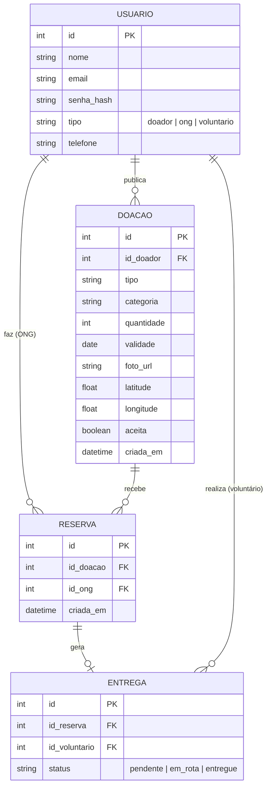
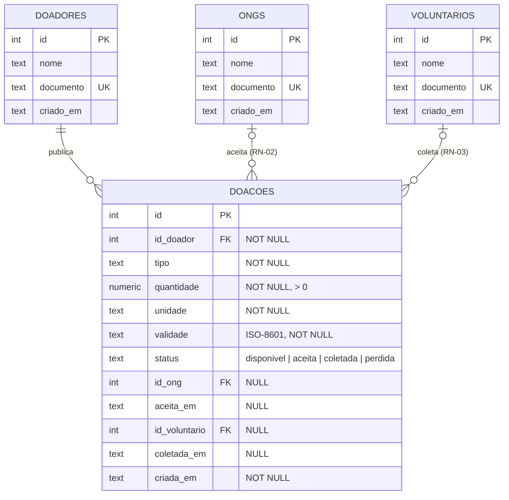

# Revisão usando IA — Modelo de dados — Prato Cheio

*Etapa 3 da atividade "Modelagem do sistema". Diagrama escolhido: **Modelo de dados** (`Modelo de dados.pdf`). Versão final corrigida: `Modelo de dados final.svg`, nesta mesma pasta.*

Escolhemos o modelo de dados, e não o de contexto, porque é nele que as regras de negócio viram estrutura: a RN-02 (aceite exclusivo) e a RN-01 (rastreabilidade mínima) dependem de colunas, cardinalidades e restrições. Um erro aqui vira bug no `repositorio.js`; um erro no diagrama de contexto seria só uma seta a mais.

## 1. Prompt usado

> Gere o modelo de dados (diagrama entidade-relacionamento) de um sistema chamado Prato Cheio, que conecta estabelecimentos que doam alimento excedente a ONGs. Doadores publicam doações com tipo, quantidade e validade; ONGs veem as doações disponíveis e aceitam; voluntários fazem a coleta. Hoje o banco tem só esta tabela: *(colado o `CREATE TABLE doacoes` de `src/db.js`)*. Inclua entidades, atributos, chaves e cardinalidades, em Mermaid.

Foi passado apenas o contexto que um usuário comum daria (descrição do sistema + schema atual), **sem** o `docs/analise.md`, justamente para ver o que a IA assume por conta própria.

## 2. Versão gerada pela IA

## 3. Comparação com a análise do grupo

| Aspecto | Nosso diagrama (etapa 2) | Versão da IA | Veredito |
|---|---|---|---|
| Separar doador, ONG e voluntário em entidades próprias, com FK em vez de texto | Sim (3 tabelas) | Parcial — uma tabela `USUARIO` com campo `tipo` | Nosso está melhor; a IA misturou papéis |
| Uma doação aceita por no máximo uma ONG (RN-02) | `id_ong` único na doação | `DOACAO ||--o{ RESERVA` — N reservas por doação | **IA errada** (E1) |
| Campos obrigatórios da publicação (RN-01, seção 10 da análise) | tipo, qtd, validade | + categoria, foto, latitude/longitude; quantidade inteira sem unidade | **IA errada** (E2) |
| Login / cadastro de perfis | Fora | e-mail + senha no modelo | **IA errada** (E3) |
| Estados da doação e carimbos de tempo | `status` texto, sem `aceita_em` | `aceita` booleano + status de entrega que não existe nas RNs | **IA errada** (E4) — e revelou uma falha nossa |
| Onde a IA acertou | — | Percebeu que `ong` como texto é frágil e criou FK; separou a coleta como relação com o voluntário | Confirma a crítica que o grupo já tinha feito ao `db.js` |

## 4. Erros e inconsistências da IA

**E1 — Cardinalidade que quebra a RN-02.** A IA criou a tabela `RESERVA` com `DOACAO ||--o{ RESERVA`, ou seja, uma doação pode ter várias reservas, sem nenhuma restrição de unicidade. Isso permite exatamente o cenário que o CA-05 proíbe: duas ONGs com reserva confirmada para a mesma doação. Além disso, o booleano `aceita` em `DOACAO` e a existência de uma linha em `RESERVA` passam a ser duas fontes de verdade para o mesmo fato, que podem divergir. Também contradiz o ADR 1, que decidiu garantir a exclusividade com um único `UPDATE … WHERE status = 'disponivel'` sobre a própria linha da doação.

**E2 — Campos fora do recorte e rastreabilidade incompleta.** A IA incluiu `foto_url`, `categoria` e `latitude/longitude` como atributos comuns da doação, contrariando a decisão da seção 10 da análise (só três campos obrigatórios; foto e categoria opcionais) e a lista "fora da fatia" (fotos e mapa). Ao mesmo tempo, modelou `quantidade` como inteiro sem unidade, o que deixa de fora justamente o que a RN-01 exige ("quantidade > 0 **com unidade**"): "5" não diz se são 5 kg ou 5 pães.

**E3 — Login e perfis embutidos no modelo.** A tabela `USUARIO` com `email` e `senha_hash` pressupõe autenticação, que a análise tirou explicitamente da fatia ("login interpõe identidade entre a ação e o dado medido"). E juntar os três papéis numa tabela com `tipo` faz a FK perder o significado: nada impede que `RESERVA.id_ong` aponte para um usuário do tipo doador.

**E4 — Estados e carimbos de tempo que não batem com as regras.** `aceita boolean` só representa dois estados, mas a RN-03 exige o ciclo `disponivel → aceita → coletada`, com retorno a `disponivel` na expiração e `perdida` quando a validade passou. O `status` de `ENTREGA` ("em_rota", "entregue") inventa uma etapa de entrega que não está em nenhuma regra nem história. E não há `aceita_em` nem `coletada_em`: sem esses carimbos, a métrica do objetivo 1 (horas entre publicação e retirada) não pode ser calculada. Ao apontar esse erro, percebemos que **o nosso próprio diagrama também não tinha `aceita_em`**, embora o `db.js` já tenha adicionado essa coluna para o CA-02.

## 5. Correções aplicadas no diagrama final

| Erro | Correção em `Modelo de dados final.svg` |
|---|---|
| E1 | Sem tabela de reservas: a doação guarda `id_ong` (FK, `NULL` enquanto disponível). Cardinalidade explícita `ONG 0..1 — 0..N Doação`. A exclusividade é garantida pela coluna única + `UPDATE` condicional do ADR 1. |
| E2 | Removidos foto, categoria e localização. `quantidade` virou `NUMERIC NOT NULL > 0` e ganhou `unidade TEXT NOT NULL`. |
| E3 | Mantidas as três tabelas de papel (`doadores`, `ongs`, `voluntarios`) só com `id`, `nome`, `documento`, `criado_em` — sem e-mail nem senha. |
| E4 | `status` com `CHECK` nos valores das RNs (`disponivel`, `aceita`, `coletada`, `perdida`), usando os mesmos nomes do código. Incluídos `aceita_em` e `coletada_em`. |

Também corrigimos a notação do nosso diagrama original: no PDF, a cardinalidade "1, n" aparecia só de um lado de cada losango. No final, cada relação tem os dois lados (`1`/`0..1` do lado do papel, `0..N` do lado da doação) e um nome (publica, aceita, coleta).

## Ponto em aberto

Com `id_ong` na própria doação, quando a RN-03 devolve uma reserva expirada à lista, o registro de quem tinha reservado é sobrescrito — e o CA-10 pede que a ONG A veja a reserva como expirada. A ideia de uma tabela de reservas (que a IA teve, mas modelou errado) pode voltar em U3 como **histórico**, com a restrição de no máximo uma reserva ativa por doação. Fica registrado para decidir junto com a implementação da RN-03.

---
*Baseado em `src/db.js`, `docs/analise.md` e `Modelo de dados.pdf` — branch `entrega-2409`.*
