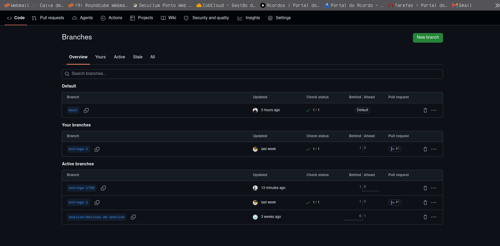
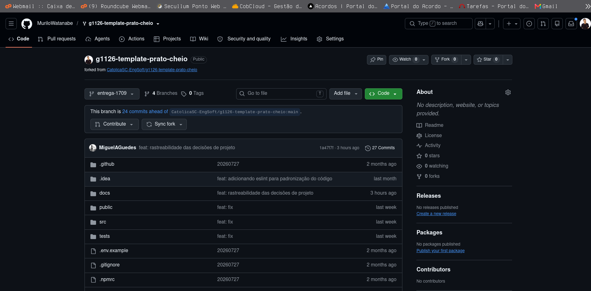

# Evidência — Proteção da branch `main`

## Regra ativada

A partir desta entrega, a branch `main` do repositório
[`g1126-template-prato-cheio`](https://github.com/MuriloWatanabe/g1126-template-prato-cheio)
está protegida. Nenhum código entra na `main` sem:

- Pull Request aberto (push direto bloqueado, inclusive para admins);
- Revisão (approve) de pelo menos **1 outro integrante do grupo**;
- Check de CI **`build-e-testes`** (workflow `.github/workflows/ci.yml`) verde;
- Branch atualizada com a `main` antes do merge (sem conflitos).

Essa regra vale a partir de hoje até o fim do semestre e é critério de aceite do Trabalho 2.

## Configuração aplicada (GitHub → Settings → Branches → Branch protection rules)

| Opção | Valor |
|---|---|
| Branch name pattern | `main` |
| Require a pull request before merging | ✅ |
| Require approvals | ✅ (mínimo 1) |
| Dismiss stale pull request approvals when new commits are pushed | ✅ |
| Require status checks to pass before merging | ✅ — `build-e-testes` |
| Require branches to be up to date before merging | ✅ |
| Do not allow bypassing the above settings (inclui administradores) | ✅ |
| Allow force pushes | ❌ |
| Allow deletions | ❌ |

## Print da configuração

## Responsável

Configurado por: **Murilo Enzo Watanabe** (permissão de administrador no repositório).

## Entrega

Esta evidência foi entregue através do primeiro Pull Request do grupo para a `main`,
a partir da branch `entrega-1709`.
